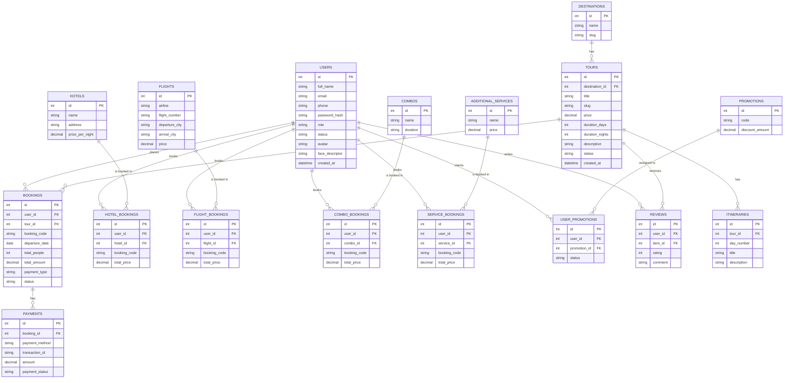

# Biểu Đồ Thực Thể Liên Kết (ERD) - Hệ Thống Đặt Tour Du Lịch

Dưới đây là biểu đồ ERD (Entity-Relationship Diagram) thể hiện các thực thể chính và mối quan hệ trong cơ sở dữ liệu của hệ thống dựa trên cấu trúc hiện tại của dự án:

> [!NOTE]
> - Biểu đồ này bao quát các module chính bao gồm: Người dùng, Đặt tour, Thanh toán, Khách sạn, Chuyến bay, Combo, Dịch vụ đi kèm và Khuyến mãi.
> - Các mối quan hệ đã được chuẩn hóa để phản ánh đúng cấu trúc liên kết hiện tại trong mã nguồn của bạn.
